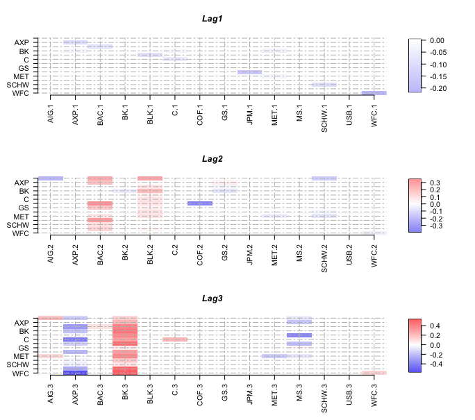

## NetVAR:Network structures in VAR models

This R-package is a software to model Vector AutoRegressive (VAR) models which are fit to data with a structure typical for networks. As the method contained in NetVAR is tailored to network structures, in the presence of such structures the model fit is improved as well as forecasting accuracy. This is particularly true in the presence of high-dimensional data and when only short time series are available. Further the model improves interpretability of the underlying data. The embedded LISAR method employs methods from the sparsity literature such as LASSO, SCAD and Adaptive LASSO. The package automatically derives the required regularisation sequences and refines it during the estimation to provide the optimal model. The package allows for model optimisation under various loss functions such as MSFE, AIC, and BIC. It provides a dedicated class, allowing for summary prints of the optimal model and a plotting function to conveniently analyse the optimal model via heatmaps.

We introduce the LISAR method embedded in the package in the paper [*"Influential assets in Large-Scale Vector AutoRegressive Models"*](https://papers.ssrn.com/sol3/papers.cfm?abstract_id=4619531).

### Installation

To install the package from GitHub, you need to have the devtools package
installed in R. If you do not have it installed already, run this code line:
```
install.packages("devtools")
```
Next, load the devtools package: 
```
library(devtools)
```
Now, you are all set to install the NetVAR package. Just run this code line 
in your R console and you are good to go: 
```
install_github("SimonTrimborn/NetVAR")
```

### Workflow & Output 

At present the package supports the LISAR method (more will come!). To get started with 
the analysis of your dataset, just run the following line: 
```
LISAR(YourDataHere, Model = "LISAR.LASSO")
```
A summary of the estimated model can be displayed by running in the console:
```
print(YourResultFromNetVAR)
```

To also see the parameters estimated, run in the console:
```
summary(YourResultFromNetVAR)
```

For datasets with many time series or when the ideal number of lags is large, analysing the parameters in a console output 
can be tedious. Therefore the results can be plotted as heatmaps for convenient analysis:
```
plot(YourResultFromNetVAR)
```

By default the heatmaps are placed jointly into one figure. To output them as individual figures, run:
```
plot(YourResultFromNetVAR, join_graphs = FALSE, )
```

By default no legend is plotted. This is because placing the heatmaps jointly into one figure, can cause issues with the legend. Sometimes the main graphs come out too small then. To also add legends, either to the individual or joined figures, run:
```
plot(YourResultFromNetVAR, legend = TRUE, )
```

The plotting function would provide a plot like this one: 



%For more details on the workflow and the output, please see the paper [*""*](https://papers.ssrn.com/sol3/papers.cfm?abstract_id=4619531). 

### Reference

When using the code in your own work, please reference to our paper. 
Thank you in advance!: 

Zhang, K., Trimborn, S., (2023) Influential assets in Large-Scale Vector AutoRegressive Models 

The manuscript can be found here: [view paper](https://papers.ssrn.com/sol3/papers.cfm?abstract_id=4619531)